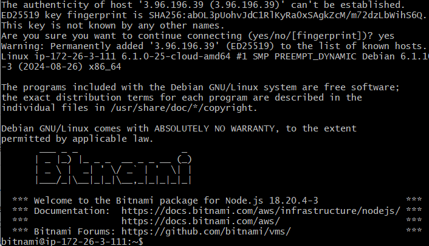
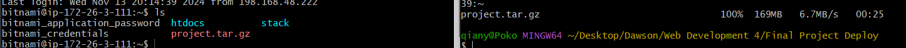

# Creating the Lightsail

## Node version on Lightsail
18.20.4-3

## After creating instance
successfully connected to instance and shows demo app

## Trying to connect
- have issues with permission (public key)
- have issues with pem file being too open
- i forgot to change the key used so it used someone else's key...
- recreated instance


## scp to copy file to instance and setup
- after downloading the tar file from artifact or taring it yourself
```
$ scp -r -i 2023-520-yourname.pem <file_to_copy> bitnami@<aws instance ip>:~
```
transfer the tar into the aws instance


ssh into the aws instance
```
ssh -i ~/2024-520-yourname.pem bitnami@<instance ip>
```

stop previous container if there is
```
forever list
forever stop <container id>
```

put the tar file in a folder you want to extract in
```
mv tarfile.gz <dest folder>
```

unzip the file
```
tar xvf <tarfile>
```

change directory into the server and run npm install
```
cd server
npm install
```

make sure to add a `.env` file to your server folder
```
ATLAS_URI=<your mongo db connect string>
```

then run the following command
```
NODE_ENV=production PORT=3001 forever start bin/www
```

apache has already been setup to change 3001 host to the server output. Make

## setup forever and apache
- had a little issue with apache from the instructions
- the instructions put 3000 on port when we were hosting on local host 3001 and i changed that after seeing the error in error_log from apache