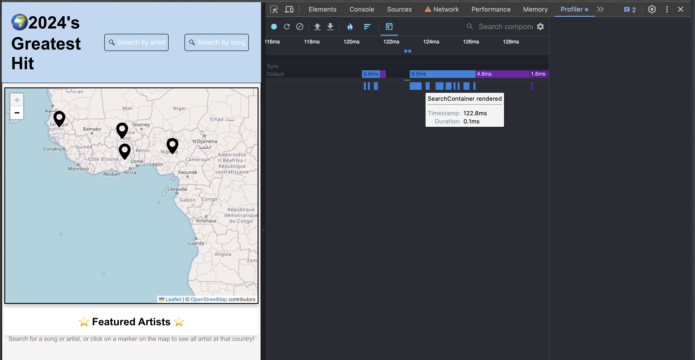
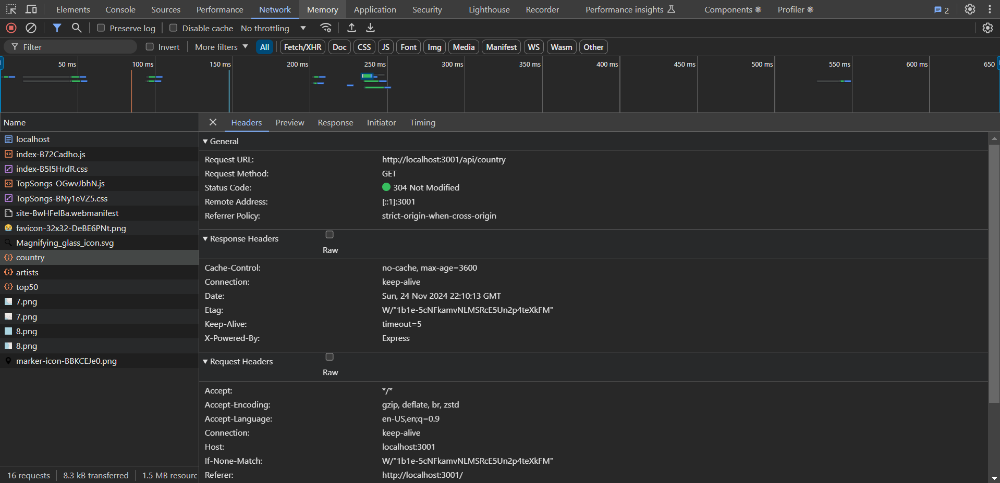
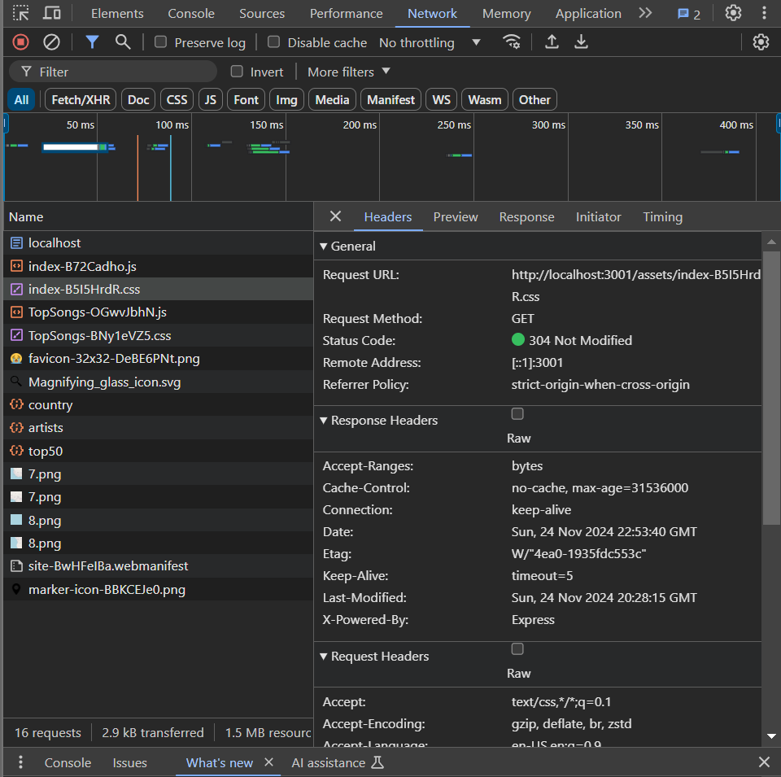

# Performance of 520 Project, Most popular songs 2024

## Introduction and Methodology

<!-- Briefly state how you gathered data about app performance, and in what environment 
(which browsers, what browser versions, what kind of device, OS,
width and height of viewport as reported in the console with `window.screen`) -->

using [Webpage Test](https://www.webpagetest.org/) 
- v129 chrome
- 4G
- Mobile

we found out that we needed to cache our api data so we don't make uncessesary requests and we should seperate our React components for a smaller size

using [Lighthouse report](https://chromewebstore.google.com/detail/lighthouse/blipmdconlkpinefehnmjammfjpmpbjk)
- microsoft edge version 131.0.2903.51
- desktop
- windows

- also recommends reducing the javascript size 
- recommends having some space between touch targets

<!-- Also report overall impact on whatdoesmysitecost results before and after all your changes -->
whatdoesmysitecost reports that it weighs 1.51MB -> 0.52MB

from lectures, we realized we could implement server memory and caching and compressing of our json responses. 

## Baseline Performance

<!-- Summarize initial results for each tool that you used. Did the tools
detect all the performance issues you see as a user? -->

Lighthouse report
- 59 Performance (however a lot of those are because of React-leaflet) -> 95
- 92 accessibility -> 96

Webtest
- start render at 8.7s -> 1.7s
- largest content paint 8.7s -> 4.6s
- page weight 1547 kb -> 534kb
- is it quick? needs improvement -> not bad
- is it usable? needs improvement -> not bad
- is it resiliant? not bad... -> not bad

we can also improve the caching, compression and server speed. The tools did not catch all these issues because it required an action to trigger.

- we improved all the caching issues
- added caching for responses and compression
## Areas to Improve

- React dynamic import
- cache static files and api results that doesn't change
- accessibility for user experience
- implement server memory
- implement compression on responses
- make sure react doesn't keep rerendering too many items

## Summary of Changes 

<!-- Briefly describe each change and the impact it had on performance (be specific). If there
was no performance improvement, explain why that might be the case -->

### Dynamically importing modules

Lead: Chen

using dynamic import, (lazy) to import react components that aren't needed on first load such as the artist side bar, the top songs at the bottom.

the huge improvement came from actually changing the plotly we were using, we first imported the biggest version that contains every single chart type which came out to be 5MB but can be reduced to 1MB if we only use the `basic` version

### Adding compression for api responses

Lead: Chen

using the [compression middleware](https://github.com/expressjs/compression) for express. We implemented compression for route endpoints. Before compression, the json would be full size. After compression, it is about ~90% smaller

#### Interesting notice
- if the json is too small, it won't use gzip most likely because of the time needed and the amount of space saved

### Adding Serverside caching for api database retrieval

Lead: Danny

following the [Lecture for Resource Loading Optimizations ](https://dawsoncollege.gitlab.io/520JS/520-Web/lectures/10_1_resource_loading.html) I implemented serverside caching so that everytime a fetch request that uses data base to return data to the request will be cached to be used again the next time it gets called. 

#### Interesting notice
I notice between the first fetch and the second fetch the difference in time is very minimal. I guess our data isn't anything our server can't handle. This was tested with no cache disabled on dev tools on arc browser.

### Testing our website with profiling

Lead: Danny

While doing profile I was looking for any unsual rerenders. From what I see there are no unusual rerenders.
The flamegraph chart shows that most rerenders happen within the world map component(parent).

The actions I performed during this test
    
    1) Clicked on a country 
    2) Clicked on a artist
    3) Searched a song
When clicking on a country the side bar and the parent world map both rerenders (normal).

when clicking on a artist the artist info container renders along with its parent world map , and the barchart. For the bar chart I believe it rerenders because it gets pushed down from the list that is being render by the artist's songs being displayed. Which seems reasonable.

when searching a song the search container, side bar, and parent world map rerenders. 
### Adding HHTP cache 

Lead: Ahmed 

Following the  [Lecture for Resource Loading Optimizations ](https://dawsoncollege.gitlab.io/520JS/520-Web/lectures/10_1_resource_loading.html) I added Cache-Control to the response headers to indicate to the browser how the cache is supposed to be used.

### Caching static files

Lead: Ahmed

Following the example for [HTTP caching](https://web.dev/articles/codelab-http-cache) given in the [Lecture for Resource Loading Optimizations ](https://dawsoncollege.gitlab.io/520JS/520-Web/lectures/10_1_resource_loading.html) i applied caching for the static files by adding a Cache-Control to the response headers to indicate to the browser how the cache is supposed to be used. 

## Conclusion

<!-- Summarize which changes had the greatest impact, note any surprising results and list 2-3 main 
things you learned from this experience. -->

### Things we learned
- Dynamically importing modules seperates the graph and map into two parts allowing for seperate downloads. However it lead us to discover that the plotly package we were using was 5 MB which was huge and we only used one type of chart so we can reduce it by using a smaller one containing only 3 chart types. This change greatly improved the build speed (18s to 5s)

- compression for api responses allows less network traffic saving time taken to get the responses. It also allows for lighter and more caching since the responses are cached compressed. This change would be more impactful if our requests were bigger but it still has impact when we click on countries with a lot of artists such as `Canada` and `US`

- adding cache for our database. This lowers the amount of times we have to make queries to our database. This lightens the network traffic from our api to our database. Also getting data from our memory is faster than requesting over the network.

- making sure our react components rerenders correctly. This would have made an improvement if we found anything we could of fixed.

- setting cache headers allows us to specify how we want the browser to cache our responses. This doesn't make much of an improvement because modern browsers automatically tries to cache responses.

- for static files however, they are not automatically cached. So setting the cache headers allows the browser to save it and return the cached files whenever we reload the page instead of fetching it over and over. This improves the inital loading time.

### Greatest impact
- dynamically importing, reduced build time by a lot
- compressing responses, reduced network request size by ~90%

### Surprising resultss
- caching makes the first request a lot slower than usual but every single next request will be lightning fast