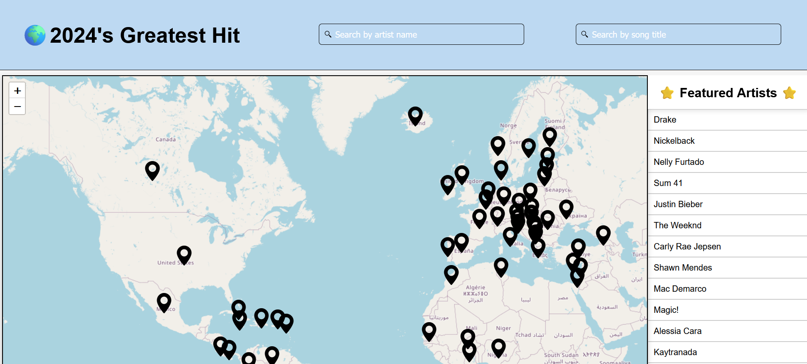
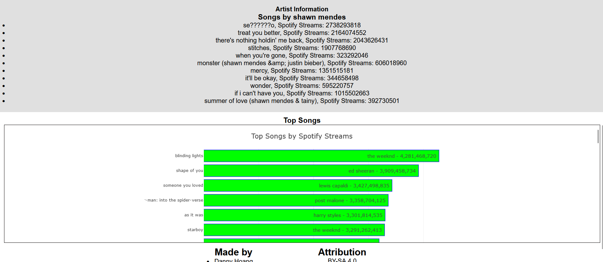

# 520-Project-Hoang-Sobh-Qian
## Notice
the seeding will not work because the data was too large to upload on GitHug Repo
## Description
A School project where we write a full-stack Mongo Express React Node (MERN) application with a focus on the visualization of a large dataset, as well as some web performance considerations. We want to showcase a map where there we can click on countries and see the artists that are from those countries, then click on any of the artist to show their popular songs in 2024.


## Setup
after cloning cd into the project
```
cd 520-project-hoang-sobh-qian
```

cd into client
```
cd client
```

run the following command
```
npm install
```

go back to the previous directory
```
cd ..
```

cd into server 

```
cd server
```

run the command
```
npm install
```

setup done, back to parent directory
```
cd ..
```

### To just run api
```
cd server
npm run dev
```

### To run the server and client 
```
cd client
npm run build
cd ../server
npm run start
```


## Attributions

- [react-leaflet](https://react-leaflet.js.org/) was used for displaying the world map and we will use markers on each country to determine which country we should display on the side bar. The side bar will contain all artists from that country.


- [horizontal bar charts](https://plotly.com/javascript/horizontal-bar-charts/) was used for displaying the TOP songs at the bottom of the page

- [swagger](https://swagger.io/) for documenting our api endpoints
---
https://creativecommons.org/publicdomain/zero/1.0/
- https://www.kaggle.com/datasets/bohnacker/country-longitude-latitude

---

https://creativecommons.org/licenses/by-sa/4.0/
- https://www.kaggle.com/datasets/pieca111/music-artists-popularity
- https://www.kaggle.com/datasets/nelgiriyewithana/most-streamed-spotify-songs-2024

## Issues with Render
- the app works fine on AWS and a fresh local clone. However in render we cannot access the search bar on first load or else the react-leaflet crashes.