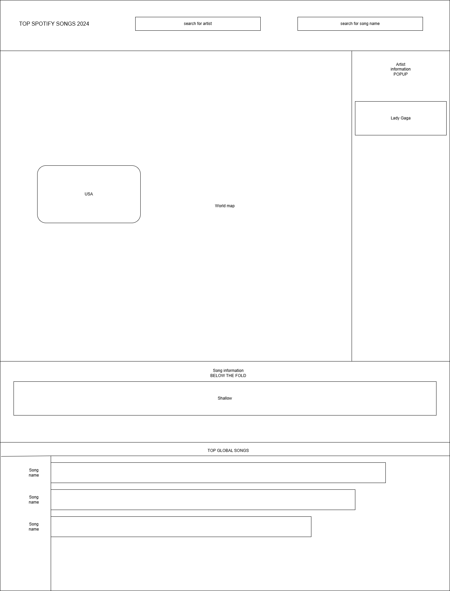
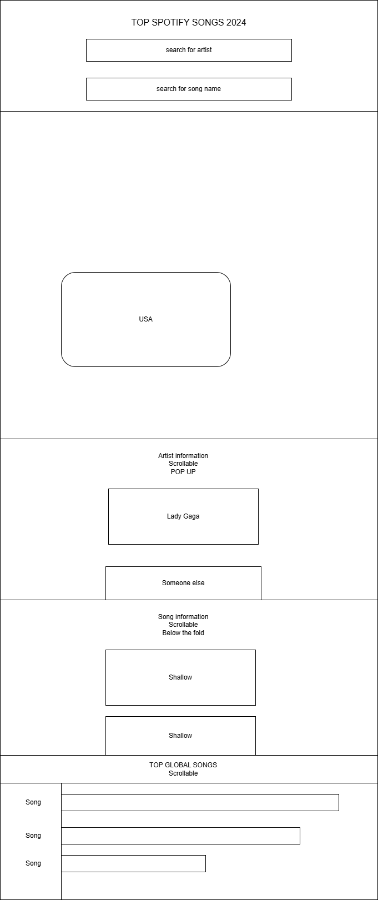

# Spotify Songs 2024
## Data
[Choosing our data](https://gitlab.com/dawson-csy3-24-25/520/section1/teams/TeamH-13/520-project-hoang-sobh-qian/-/issues/1)
we chose 3 datasets to combine together, one with `Top spotify songs from 2024`, one with `top artists on Last.fm` and `all countries with their longitude and latitude`.
We will only save relevant data that contains artists mentioned in the `Top Spotify Songs 2024` and connect them to their countries using `Top artists on Last.fm` and finally display
them in the web server with the `All countries` using latitude and longitude.
## API
`/api/:artist` 
- will return all songs from an artist (track name, all time rank) and the country they are from

`/api/:song` 
- will return information about a single song (track name, artist, all time rank, spotify streams, youtube views, tiktok views)

`/api/:country` 
- returns a list of artists that are from the country

## Visualizations
We want to show countries with artists that have top songs on spotify in a map. Letting the user move around each country, explore different artists from different countries that are popular worldwide. Basically just discover different types of music from different countries.
## Views
#### PC Display
only the map will be displayed and when we click on a country a pop up containing the artists of that country will show on the right side of the screen.

when clicking on a artist from the pop up. We will fetch that artist information and display it on the section below the fold

there is a horizontal bar chart at the bottom of the page containing top songs global.

#### Mobile Display
the artist information will be a pop up coming from the bottom when a country is clicked

song information tab will be below the fold and we will fetch information when markers on the map per country are clicked and when the artist is selected

there is a horizontal bar chart at the bottom of the page containing top songs global.

## Functionality
- the user can search for a song in the top search bar and it will bring up the popup for the artist
- the user can search for an artist in the top search bar and it will move the map to the country where the artist is from
- the user can move and drag around the map and click on markers on each country with artists
- once clicked all artists from clicked country will be shown on the side bar and we can select an artist
- all songs that are popular in 2024 from that artist will be shown below artist information

## Features and Priorities
#### Core features
- the user can click on markers on the map and display all artists from that country
- the user can search for an artist
- the user can search for a song
- the user can click on the artist in the side bar and bring up all their songs
- the side bar pop up will change depending on viewport size using Media query
- at the bottom of the page there will contain a horizontal bar chart using plotly of
top songs global

#### Additional features
- the map will move to the country where the artist if from when you search for the artist
- highlighting the artist and song selected

## Dependencies
- [react-leaflet](https://react-leaflet.js.org) will be used for displaying the world map and we will use markers on each country to determine which country we should display on the side bar. The side bar will contain all artists from that country.

- [horizontal bar charts](https://plotly.com/javascript/horizontal-bar-charts/) will be used for displaying the TOP songs at the bottom of the page

we considered only using bar charts however, we feel like having a map makes this a lot more interesting and interactive.

## References
- [media query](https://developer.mozilla.org/en-US/docs/Web/CSS/CSS_media_queries/Using_media_queries) will be used for
changing the way the pop up shows.
